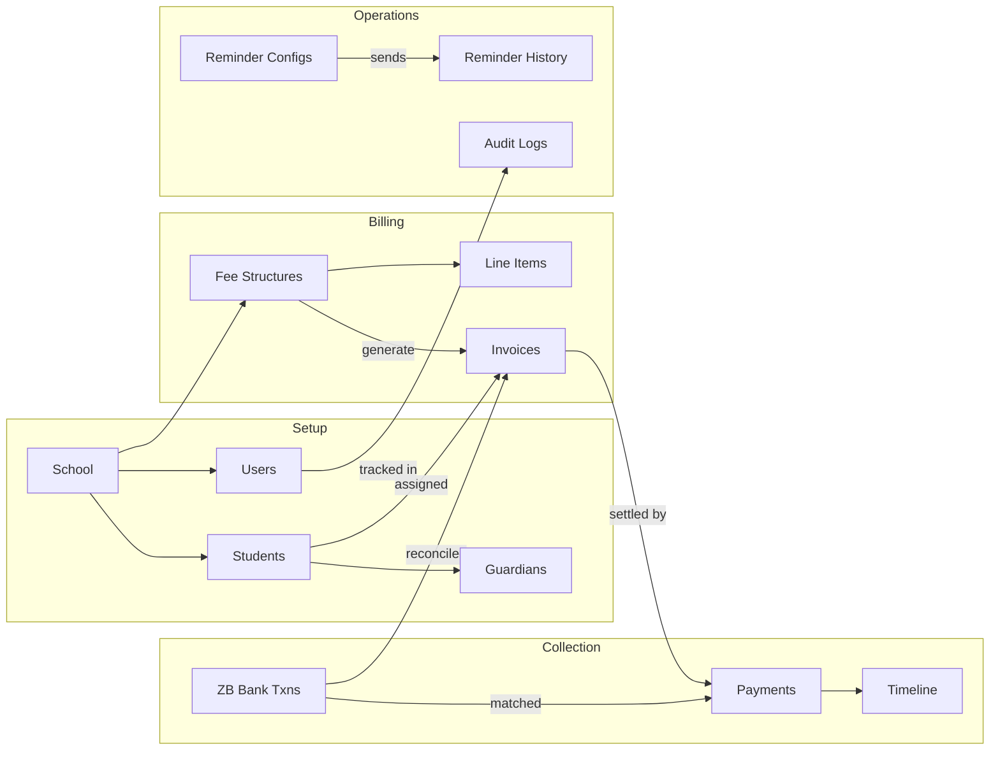

# FundoWallet — Database Entity Relationship Diagram

> **Date:** 2026-03-21
> **Database:** PostgreSQL 16 (production) / SQLite (dev)
> **ORM:** SQLAlchemy 2.0 (async)
> **Migrations:** Alembic

---

## ERD Diagram

```mermaid
erDiagram
    SCHOOLS ||--o{ USERS : "has"
    SCHOOLS ||--o{ STUDENTS : "enrolls"
    SCHOOLS ||--o{ FEE_STRUCTURES : "defines"
    SCHOOLS ||--o{ STUDENT_INVOICES : "issues"
    SCHOOLS ||--o{ PAYMENTS : "collects"
    SCHOOLS ||--o{ REMINDER_CONFIGS : "configures"
    SCHOOLS ||--o{ REMINDER_HISTORY : "sends"
    SCHOOLS ||--o{ AUDIT_LOGS : "tracks"
    SCHOOLS ||--o{ ROLES : "owns"
    SCHOOLS ||--o{ ZB_TRANSACTIONS : "receives"
    SCHOOLS ||--o{ ZB_RECONCILIATION_RUNS : "runs"

    USERS ||--o{ PAYMENTS : "records"
    USERS ||--o{ STUDENT_IMPORTS : "uploads"
    USERS ||--o{ AUDIT_LOGS : "performs"
    USERS }o--|| ROLES : "assigned"

    ROLES ||--o{ ROLE_PERMISSIONS : "grants"
    PERMISSIONS ||--o{ ROLE_PERMISSIONS : "included_in"

    STUDENTS ||--o{ GUARDIANS : "has"
    STUDENTS ||--o{ STUDENT_INVOICES : "owes"
    STUDENTS ||--o{ PAYMENTS : "pays"

    FEE_STRUCTURES ||--o{ FEE_LINE_ITEMS : "contains"
    FEE_STRUCTURES ||--o{ STUDENT_INVOICES : "generates"

    STUDENT_INVOICES ||--o{ PAYMENTS : "settled_by"

    PAYMENTS ||--o{ PAYMENT_TIMELINE : "logs"

    REMINDER_CONFIGS ||--o{ REMINDER_HISTORY : "triggers"

    ZB_TRANSACTIONS }o--o| STUDENT_INVOICES : "matched_to"
    ZB_TRANSACTIONS }o--o| PAYMENTS : "reconciled_with"

    SCHOOLS {
        string id PK "UUID"
        string name "NOT NULL"
        text address
        string phone
        string email
        string city
        string state
        string country
        string website
        string logo_url
        text receipt_footer
        string merchant_code
        string biller_code
        string account_identifier
        text academic_term_config "JSON"
        string currency "default: USD"
        string timezone "default: UTC"
        datetime created_at
        datetime updated_at
    }

    PERMISSIONS {
        string id PK "UUID"
        string action UK "e.g. students.read"
        text description
        datetime created_at
    }

    ROLES {
        string id PK "UUID"
        string name "e.g. ADMIN"
        string slug "e.g. admin"
        text description
        string school_id FK "nullable (system roles)"
        boolean is_system "default: false"
        datetime created_at
        datetime updated_at
    }

    ROLE_PERMISSIONS {
        string id PK "UUID"
        string role_id FK "CASCADE"
        string permission_id FK "CASCADE"
    }

    USERS {
        string id PK "UUID"
        string school_id FK
        string email UK "NOT NULL, indexed"
        string phone
        string first_name "NOT NULL"
        string last_name "NOT NULL"
        text password_hash "NOT NULL"
        string role "legacy column"
        string role_id FK "NOT NULL"
        string avatar_url
        boolean is_active "default: true"
        datetime last_login_at
        integer token_version "default: 0"
        datetime created_at
        datetime updated_at
    }

    STUDENTS {
        string id PK "UUID"
        string school_id FK "NOT NULL"
        string student_id UK "display ID: STD-2026-001"
        string first_name "NOT NULL"
        string last_name "NOT NULL"
        string email
        string phone
        string grade
        string class_name
        string status "ACTIVE | INACTIVE | GRADUATED | TRANSFERRED"
        string date_of_birth "YYYY-MM-DD"
        string enrollment_date "YYYY-MM-DD"
        float balance "default: 0.0"
        string guardian_name "legacy"
        string guardian_email "legacy"
        string guardian_phone "legacy"
        datetime created_at
        datetime updated_at
    }

    GUARDIANS {
        string id PK "UUID"
        string student_id FK "NOT NULL"
        string first_name "NOT NULL"
        string last_name "NOT NULL"
        string relationship "NOT NULL"
        string phone "NOT NULL"
        string email
        boolean is_primary "default: false"
    }

    STUDENT_IMPORTS {
        string id PK "UUID"
        string school_id FK "NOT NULL"
        string file_name "NOT NULL"
        integer total_rows "default: 0"
        integer successful_rows "default: 0"
        integer failed_rows "default: 0"
        string status "default: completed"
        text errors "JSON"
        string created_by FK "users.id"
        datetime created_at
    }

    FEE_STRUCTURES {
        string id PK "UUID"
        string school_id FK "NOT NULL"
        string name "NOT NULL"
        text description
        string grade "legacy single grade"
        text grades_json "JSON array of grades"
        float amount "total amount"
        string currency "default: USD"
        string academic_year
        string term
        string due_date "YYYY-MM-DD"
        boolean is_published "default: false"
        string status "DRAFT | PUBLISHED"
        integer version "default: 1"
        datetime published_at
        datetime created_at
        datetime updated_at
    }

    FEE_LINE_ITEMS {
        string id PK "UUID"
        string fee_structure_id FK "NOT NULL"
        string name "NOT NULL"
        float amount "NOT NULL"
        text description
        boolean is_optional "default: false"
    }

    STUDENT_INVOICES {
        string id PK "UUID"
        string school_id FK "NOT NULL"
        string student_id FK "NOT NULL"
        string fee_structure_id FK "NOT NULL"
        string invoice_number UK "e.g. INV-2026-1001"
        float amount "total invoiced"
        float amount_paid "default: 0.0"
        float balance "remaining"
        string status "UNPAID | PARTIAL | PAID | OVERDUE"
        string currency "default: USD"
        string due_date "YYYY-MM-DD"
        datetime created_at
        datetime updated_at
    }

    PAYMENTS {
        string id PK "UUID"
        string school_id FK "NOT NULL"
        string student_id FK "NOT NULL"
        string invoice_id FK "NOT NULL"
        float amount "NOT NULL"
        string method "cash | bank_transfer"
        string channel "ECOCASH | BANK_TRANSFER etc"
        string provider
        string payer_name
        string payer_phone
        string payer_email
        string receipt_number "RCP-YYYY-XXXXXX"
        string currency "default: USD"
        text metadata_json "JSON provider data"
        string reference
        string status "completed | pending | failed"
        text notes
        datetime paid_at
        string created_by FK "users.id"
        datetime created_at
        datetime updated_at
    }

    PAYMENT_TIMELINE {
        string id PK "UUID"
        string payment_id FK "NOT NULL"
        string event "NOT NULL"
        text description
        datetime timestamp
    }

    REMINDER_CONFIGS {
        string id PK "UUID"
        string school_id FK "NOT NULL"
        string name "NOT NULL"
        string type "legacy: email | sms"
        string timing "BEFORE_DUE | ON_DUE | AFTER_DUE"
        text channels_json "JSON: SMS, EMAIL, WHATSAPP"
        string audience "ALL | GRADE | CUSTOM"
        text grades_json "JSON array"
        text student_ids_json "JSON array"
        text template "legacy"
        text message_template "new"
        integer days_before_due "legacy, default: 7"
        integer days_offset "new"
        boolean is_active "default: true"
        datetime created_at
        datetime updated_at
    }

    REMINDER_HISTORY {
        string id PK "UUID"
        string school_id FK "NOT NULL"
        string reminder_config_id FK "NOT NULL"
        string student_id FK "nullable"
        string invoice_id
        string status "default: sent"
        string config_name
        integer recipient_count "default: 0"
        integer delivered_count "default: 0"
        integer failed_count "default: 0"
        text channels_json "JSON"
        datetime sent_at
    }

    AUDIT_LOGS {
        string id PK "UUID"
        string school_id FK
        string actor_id "references users.id"
        string action "NOT NULL"
        string entity "NOT NULL"
        string entity_id
        text metadata_json "JSON details"
        string ip_address
        text user_agent
        datetime timestamp
    }

    ZB_TRANSACTIONS {
        string id PK "UUID"
        string school_id FK "NOT NULL"
        string zb_id "NOT NULL"
        float amount "NOT NULL"
        string date
        string transaction_date
        text narrative
        string reference
        string source
        string status
        string nr1
        string nr2
        string nr3
        string nr4
        string picked
        string tcd
        boolean is_matched "default: false"
        string matched_invoice_id FK
        string matched_payment_id FK
        datetime fetched_at
    }

    ZB_RECONCILIATION_RUNS {
        string id PK "UUID"
        string school_id FK "NOT NULL"
        datetime started_at
        datetime completed_at
        integer total_transactions "default: 0"
        integer matched_count "default: 0"
        integer unmatched_count "default: 0"
        integer skipped_count "default: 0"
        float total_amount_reconciled "default: 0.0"
        string status "pending | completed | failed"
        text error_details
    }
```

---

## Table Summary

| # | Table | Rows Purpose | Key Relationships |
|---|-------|-------------|-------------------|
| 1 | `schools` | School organization | Root entity — all data is school-scoped |
| 2 | `permissions` | RBAC action definitions | `students.read`, `fees.write`, etc. |
| 3 | `roles` | Named role groups | ADMIN, FINANCE, STAFF (system or per-school) |
| 4 | `role_permissions` | Role-to-permission mapping | Junction table (M:N) |
| 5 | `users` | School staff accounts | Belongs to school + role |
| 6 | `students` | Enrolled students | Belongs to school, has guardians |
| 7 | `guardians` | Student parent/guardian contacts | Belongs to student (1:N) |
| 8 | `student_imports` | CSV import job records | Created by user |
| 9 | `fee_structures` | Fee definitions per term/grade | Has line items, generates invoices |
| 10 | `fee_line_items` | Individual fee components | Tuition, sports, lab fees, etc. |
| 11 | `student_invoices` | Per-student billing records | Links student to fee structure |
| 12 | `payments` | Payment transactions | Against an invoice, by a student |
| 13 | `payment_timeline` | Payment status change log | Initiated → Processing → Success |
| 14 | `reminder_configs` | Reminder rule definitions | Timing, channels, audience |
| 15 | `reminder_history` | Sent reminder records | Per-config send history |
| 16 | `audit_logs` | System activity log | Who did what, when, from where |
| 17 | `zb_transactions` | ZB Bank payment records | External bank data |
| 18 | `zb_reconciliation_runs` | Bank reconciliation batches | Matches bank txns to invoices |

---

## Data Flow

---

## Multi-Tenancy Model

All data is **school-scoped** via `school_id` foreign keys. Every query must filter by the authenticated user's `school_id` to enforce tenant isolation. The only exceptions are:

- `permissions` — global, shared across all schools
- `roles` with `school_id = NULL` — system-defined roles (ADMIN, FINANCE, STAFF)
- `roles` with `school_id` set — custom per-school roles

---

## ID Strategy

- All primary keys are **UUID v4** strings (36 chars)
- Display IDs are separate fields: `student_id` (STD-2026-001), `invoice_number` (INV-2026-1001), `receipt_number` (RCP-2026-XXXXXX)
- Foreign keys reference the UUID, not the display ID

---

## Timestamp Strategy

- All timestamps use `DateTime(timezone=True)` — stored as UTC
- `created_at` and `updated_at` auto-set via Python lambdas (`datetime.now(UTC)`)
- `updated_at` uses `onupdate` trigger
- Date-only fields (due dates, DOB) stored as `String(20)` in `YYYY-MM-DD` format

---

## JSON Storage Pattern

Several tables use `Text` columns to store JSON-encoded arrays/objects:

| Table | Column | Contains |
|-------|--------|----------|
| `fee_structures` | `grades_json` | `["Form 4", "Form 5"]` |
| `reminder_configs` | `channels_json` | `["SMS", "EMAIL"]` |
| `reminder_configs` | `grades_json` | `["Form 1", "Form 2"]` |
| `reminder_configs` | `student_ids_json` | `["uuid1", "uuid2"]` |
| `reminder_history` | `channels_json` | `["SMS"]` |
| `payments` | `metadata_json` | `{"provider_ref": "..."}` |
| `audit_logs` | `metadata_json` | `{"name": "Fee Structure"}` |
| `schools` | `academic_term_config` | `{"currentTerm": "...", "terms": [...]}` |
| `student_imports` | `errors` | `[{"row": 12, "message": "..."}]` |

These are parsed by the API layer into proper typed objects before returning to the frontend.
